# Informe de Práctica: Proyecto Node.js con CI

## Datos Generales

- **Nombre del estudiante:** Julio Viche
- **Materia:** Pruebas de Software
- **Docente:** Ing. Enrique Calvopiña
- **Fecha:** 22 de enero de 2026
- **Tema:** Desarrollo de proyecto Node.js con pruebas unitarias y CI

---

## Introducción

Este informe documenta el desarrollo de un proyecto Node.js siguiendo la guía proporcionada por el docente. Se implementó una estructura básica, pruebas unitarias, configuración de ESLint y un flujo de integración continua (CI) con GitHub Actions. Se incluyen evidencias de cada paso realizado.

---

## Objetivos

- Implementar la estructura base de un proyecto Node.js.
- Configurar dependencias y herramientas de calidad de código.
- Desarrollar pruebas unitarias y asegurar su ejecución automática mediante CI.
- Documentar el proceso y resultados obtenidos.

---

## Desarrollo

### 1. Estructura del Proyecto

Se creó la siguiente estructura de carpetas y archivos:

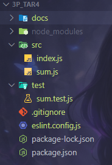

### 2. Instalación de Dependencias

- Inicialización del proyecto: `npm init -y`
- Instalación de Express: `npm install express`
- Instalación de Jest y ESLint: `npm install --save-dev jest eslint`

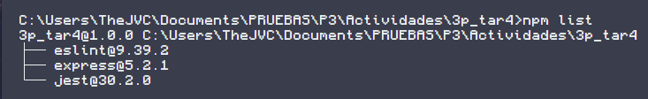

### 3. Creación de Archivos Base

- **index.js:** Servidor Express con endpoint básico.

    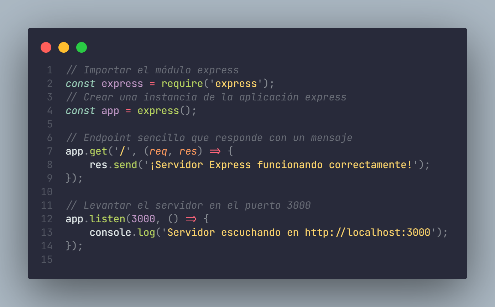

- **sum.js:** Función de suma exportable.

    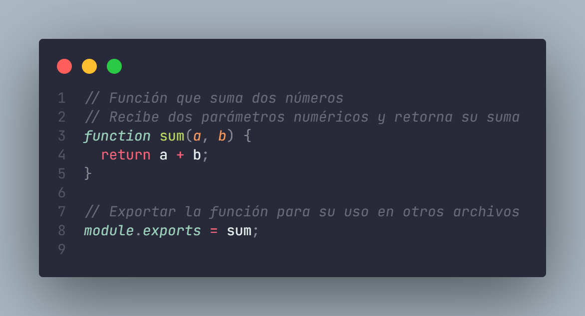

- **sum.test.js:** Prueba unitaria para suma.

    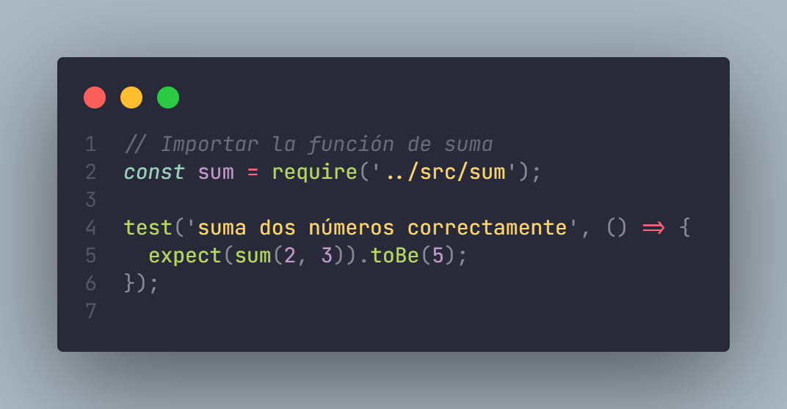

- **math.js:** Funciones factorial y fibonacci.

    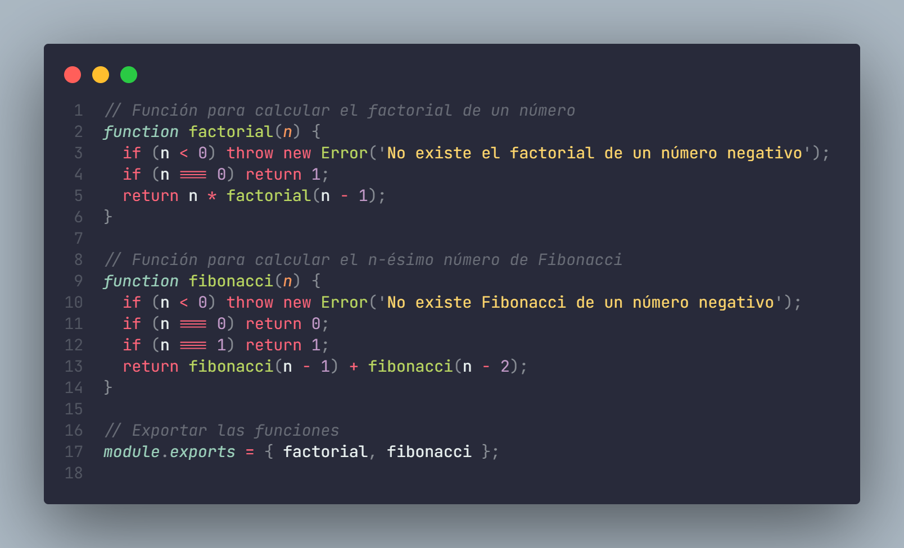

- **math.test.js:** Pruebas unitarias para factorial y fibonacci.
  
    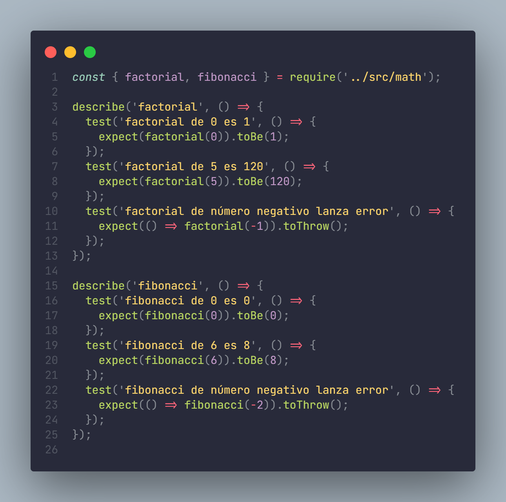

### 4. Configuración de Scripts y ESLint

- Scripts en `package.json` para start, test y lint.

    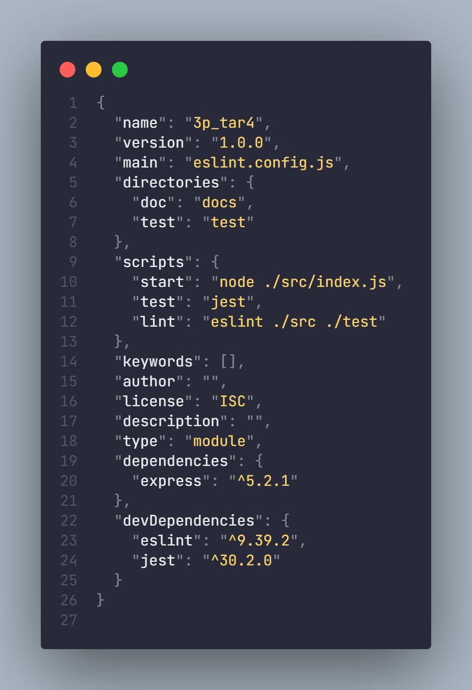

- Configuración de ESLint en formato flat config en `eslint.config.js`

    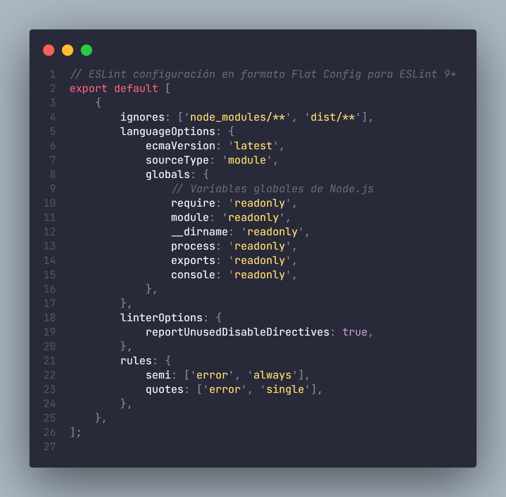

- Usar `.gitignore` para `node_modules` y archivos temporales.

### 5. Configuración de Git y CI

- Inicialización de repositorio Git y primer commit.

    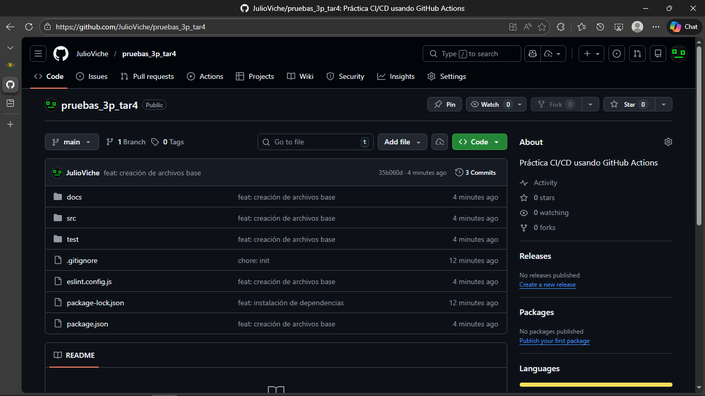

- Configuración de GitHub Actions en `.github/workflows/ci.yml` para ejecutar lint y pruebas en cada push o pull request.

    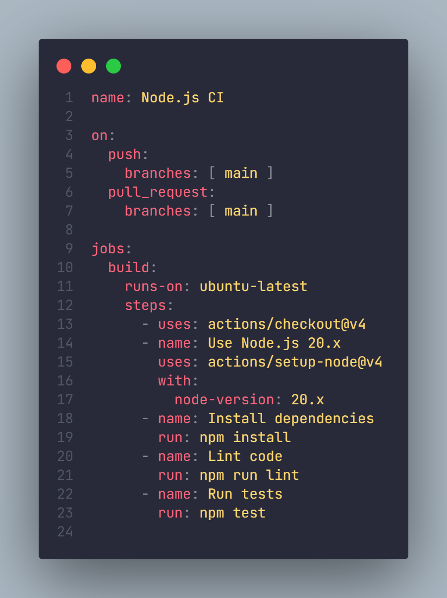

- Evidencia del funcionamiento de GitHub Actions.

    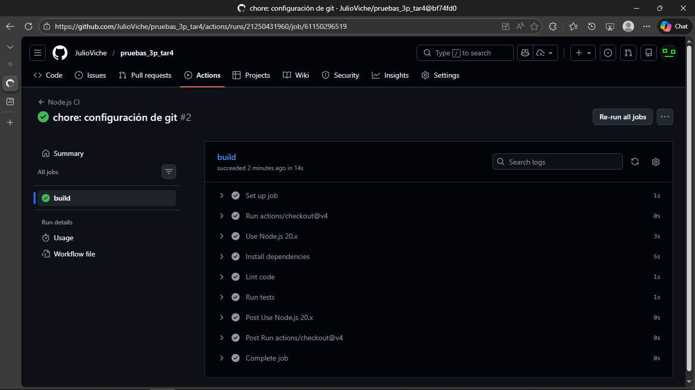

### 6. Actividades con Github Actions

- Al pushear `math.js` y `math.test.js`

    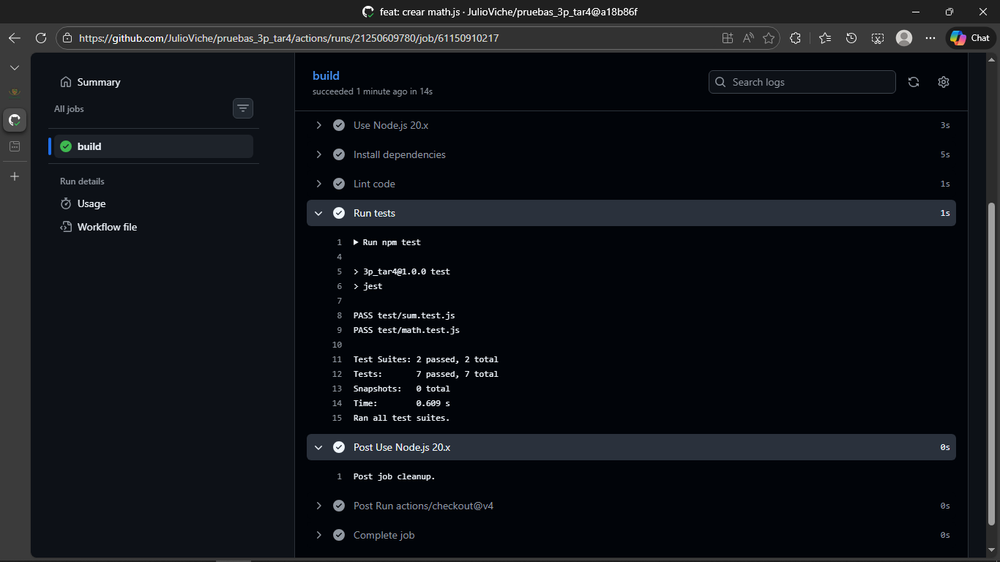

- Se modificó `sum.js` agregando un fallo a propósito.
  
    

- Al pushear el cambio en `sum.js`
  
    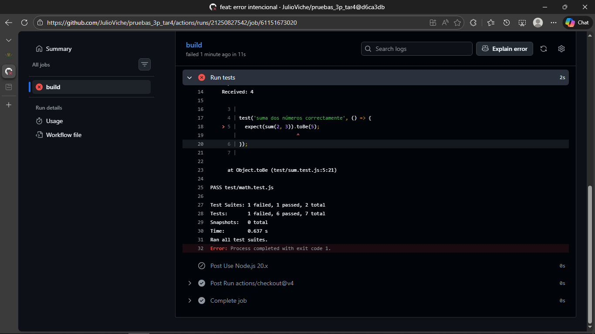

- Al corregir y pushear otra vez

    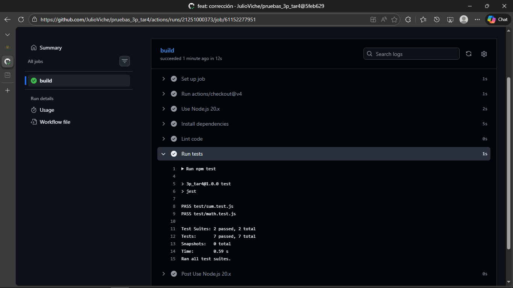

---

## Resultados Obtenidos

- Se demostró cómo se ejecutan pruebas de manera automática en `sum.js` y `math.js` usando `sum.test.js` y `math.test.js` respectivamente en Github Actions.
- Se demostró que se detectan errores de manera efectiva.

---

## Conclusiones

1. La integración de pruebas unitarias y flujos de CI en proyectos Node.js permite detectar errores de manera temprana y automática, mejorando la calidad del software.
3. Se presentó un inconveniente con la configuración de ESLint, ya que la versión utilizada requiere el nuevo formato Flat Config (export default), lo que obligó a adaptar la configuración en el commit [bf74fd0](https://github.com/JulioViche/pruebas_3p_tar4/commit/bf74fd05633e93f785d238400bf569ad52cb98ec) para que ESLint funcionara correctamente en la versión 9+.
4. Se documentó y evidenció cada paso para facilitar la comprensión y replicabilidad del proceso.

---

## Recomendaciones

1. Verificar siempre la versión de las herramientas instaladas y consultar la documentación oficial para evitar problemas de compatibilidad, como ocurrió con ESLint.
2. Mantener el código y las configuraciones actualizadas según las mejores prácticas recomendadas por la comunidad.
3. Comentar el código y documentar el proceso para facilitar el mantenimiento y la colaboración en equipo.

---

## Anexos

- [Repositorio público de Github](https://github.com/JulioViche/pruebas_3p_tar4)